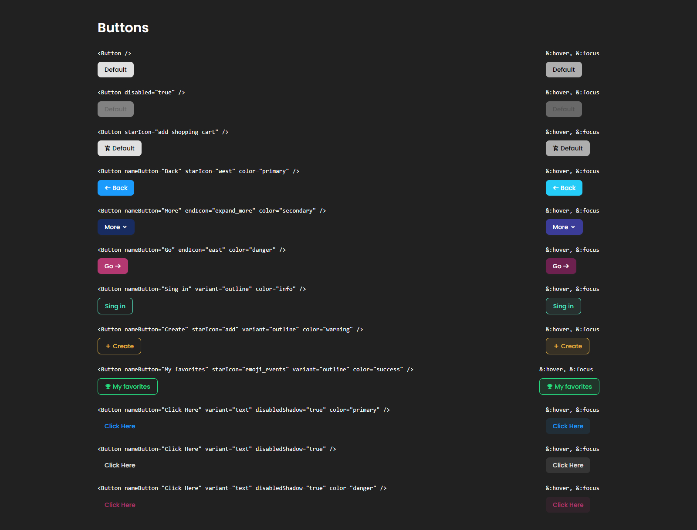

<!-- Please update value in the {}  -->

<h1 align="center">Button Component Master</h1>

<div align="center">
   Solution for a challenge from  <a href="http://devchallenges.io" target="_blank">Devchallenges.io</a>.
</div>

<div align="center">
  <h3>
    <a href="https://mooenz.github.io/button-component-master/">
      Demo
    </a>
    <span> | </span>
    <a href="https://devchallenges.io/solutions/cMLm47uQoM2zM5YvPbv7">
      Solution
    </a>
    <span> | </span>
    <a href="https://devchallenges.io/challenges/ohgVTyJCbm5OZyTB2gNY">
      Challenge
    </a>
  </h3>
</div>

<!-- TABLE OF CONTENTS -->

## Table of Contents

- [Table of Contents](#table-of-contents)
- [Overview](#overview)
  - [Built With](#built-with)
- [How To Use](#how-to-use)
  - [Compile and Hot-Reload for Development](#compile-and-hot-reload-for-development)
  - [Compile and Minify for Production](#compile-and-minify-for-production)
- [Contact](#contact)

<!-- OVERVIEW -->

## Overview


<!--  -->

### Built With

- [Vue.js](https://vuejs.org/)

## How To Use

```sh
npm install
```

### Compile and Hot-Reload for Development

```sh
npm run dev
```

### Compile and Minify for Production

````sh
npm run build
````

## Contact

- Website [mooenz.me](https://www.mooenz.me/)
- GitHub [@mooenz](https://github.com/Mooenz)
- Twitter [@mooenzdev](https://twitter.com/MooenzDev)
